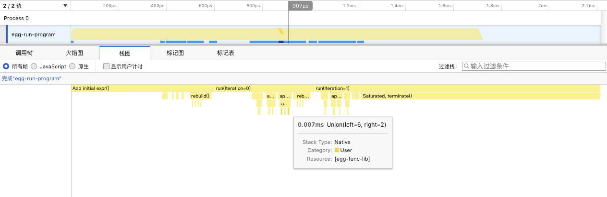
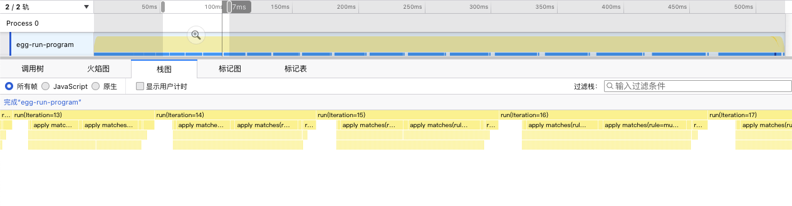

# eperf

Eperf convert egg operations into a linux perf like script that can be visualized by a profiler, say, Firefox profiler.

Here I added hooks in egg to produce logs during a equality saturation run into stdin. This is added to branch `eperf-log-br` in my egg fork.
Diff see [here](https://github.com/egraphs-good/egg/compare/main...LuxxxLucy:egg:eperf-log-br)

The part should be running the equality saturation and then save the info logs into stdin

```
cargo run --bin egg_run > tmp.data
```

It outputs something like 
```
...
EPERF_LOG [48.488953]: run (Iteration=0) START
EPERF_LOG [48.489146]: find matches (9 matches) 
EPERF_LOG [48.489157]: apply matches (rule=cancel-multiply, num_matches=1) START
EPERF_LOG [48.489168]: apply match START
EPERF_LOG [48.489175]: Union (left=0, right=3) START
EPERF_LOG [48.489188]: Union (left=0, right=3) END
EPERF_LOG [48.489195]: apply match END
EPERF_LOG [48.489200]: apply matches (rule=cancel-multiply, num_matches=1) END
EPERF_LOG [48.489211]: apply matches (rule=commute-mul, num_matches=1) START
EPERF_LOG [48.489218]: apply match START
EPERF_LOG [48.489226]: Add new node (id=4, enode=SymbolLang { op: "*", children: [1, 0] }) START
EPERF_LOG [48.489235]: Add new node (id=4, enode=SymbolLang { op: "*", children: [1, 0] }) END
EPERF_LOG [48.489243]: Union (left=4, right=2) START
EPERF_LOG [48.489252]: Union (left=4, right=2) END
...
```


Then we will read and parse the data `tmp.data` and then output the trace into a linux perf-like file `perf.script`.

```
cargo run --bin eperf script -o perf.script tmp.data
```

It can be loaded by, say, firefox profiler

This is a test run as in `bin/egg_run.rs` (corresponding data and script file also included in assets)



Here is by enabling a lot more (not really necessary) rules in egg_run.rs (line 34~40) which results in a much longer equality saturation process



